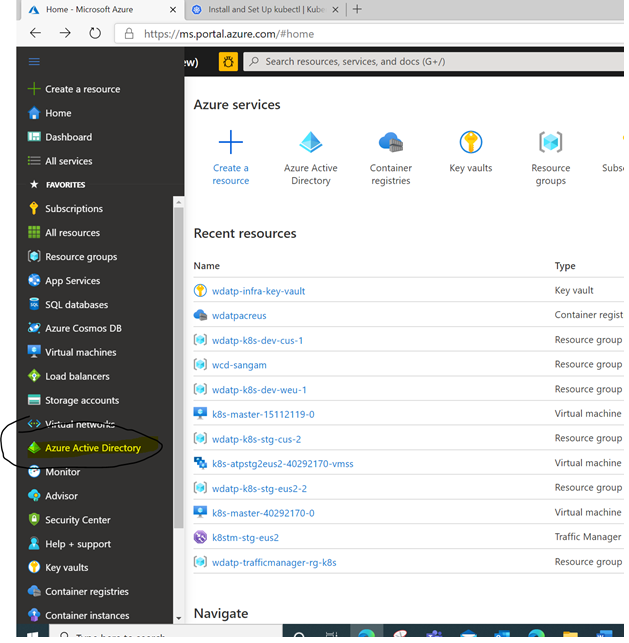
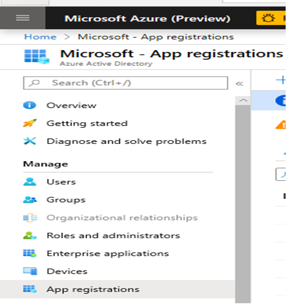
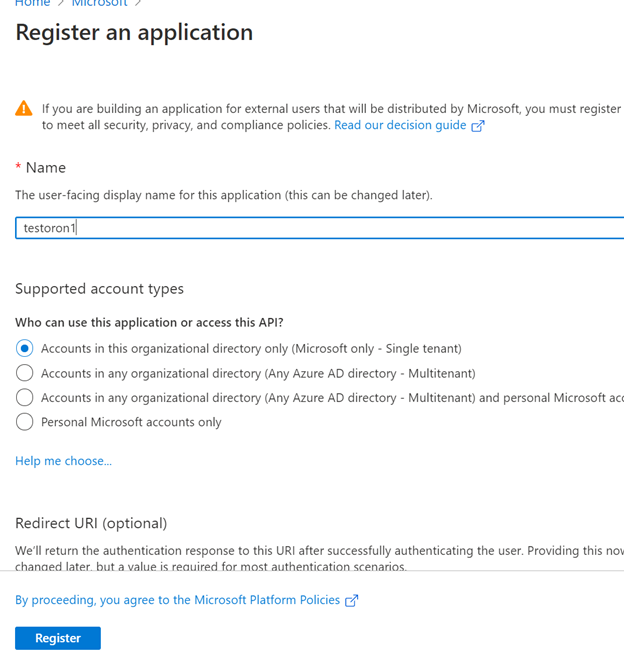
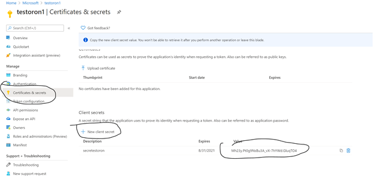
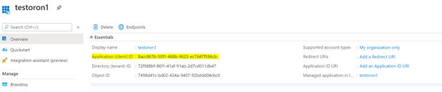
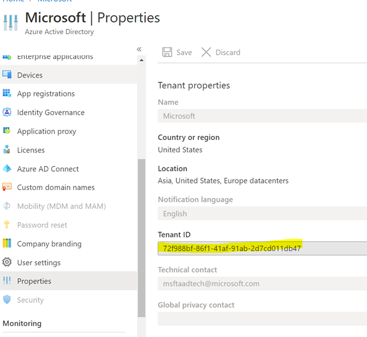
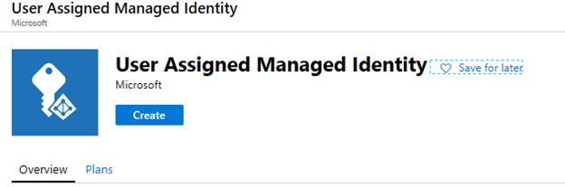
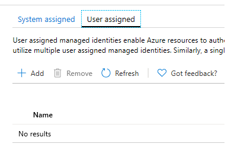
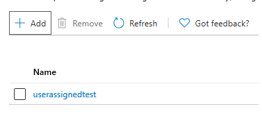
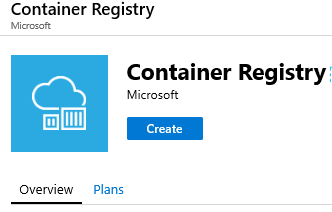

# Cluster creation

## Prerequisites
- Azure subscription (`Owner` permissions)
- [Docker for Desktop](https://hub.docker.com/editions/community/docker-ce-desktop-windows)
- [Kubectl](https://storage.googleapis.com/kubernetes-release/release/v1.18.6/bin/windows/amd64/kubectl.exe) (You might not need is, can be configured via Docker For Desktop. Just make sure you have kubectl on your machine)
- [Helm](https://github.com/helm/helm/releases/tag/v2.16.1) (Note that we still use Helm 2 for this lab, which is end of life soon)
- [AZ CLI](https://docs.microsoft.com/en-us/cli/azure/install-azure-cli?view=azure-cli-latest)

## Lab goals
- Create cluster using AKS
- Kube-config location
- Namespaces
- Limits
- PriorityClass
- Helm installation
- Pull & tag & push Geneva containers


## Let's start!
### Create AAD application 

  
  
  

### Create AAD application secret
  
  

**Give the application `Owner` permissions on the subscription. Owner permissions are necessary to continue with the following steps.**  ([Azure documentation](https://docs.microsoft.com/en-us/azure/role-based-access-control/role-assignments-portal))  
  
Make sure you have the following properties saved:
```
- Application client ID 
- Application secret
- Tenant ID 
```
**Note**: You can get the tenant id from Azure active directory -> properties -> Directory ID:  
  

### Cluster creation using AKS
Please make sure you use the latest version of AZ CLI.  
Run the following commands (fill in the missing sections in `<>`)
```
az login --service-principal -u <Application client ID> -p <Application secret>  --tenant <Tenant ID>

az account set --subscription "<subscription id>”

az group create --name MyManagedClusterRG --location eastus2

az aks create --resource-group  MyManagedClusterRG --name MyManagedCluster --generate-ssh-keys --kubernetes-version "1.18.6" --location eastus2 --node-osdisk-size 400 --node-vm-size Standard_DS4_v2 --load-balancer-sku standard --vm-set-type VirtualMachineScaleSets --enable-cluster-autoscaler --max-count 10 --min-count 5 --node-count 5 --service-principal <client id> --client-secret <secret>

az aks get-credentials --resource-group MyManagedClusterRG --name MyManagedCluster
```
In the folder %USER%/.kube config file supposed to be created.
 
#### Validation
Run the following command and expect list of pods names:
```
kubectl get pods -n kube-system
```

### Add User Assigned Managed Identity
Create User Assigned Managed Identity in the same resource group where the cluster's resources are located (should start with MC_MyManagedClusterRG_*). You can use [this](https://docs.microsoft.com/en-us/azure/active-directory/managed-identities-azure-resources/how-to-manage-ua-identity-portal) for detailed explanation. 
Should look like this:  
  

Go to the VMSS that was created by the AKS cluster creation command (under MC_MyManagedClusterRG_* resource group), and click on the Identity section:  
  
  
Add the identity that you just created:  
  

You can validate that the identity was actually assigned by running the following commands: 
```
// replace findstr with grep for Linux or Mac
kubectl get pods -n kube-system | findstr autoscaler 

kubectl exec -it -n kube-system <autoscaler pod name> bash

curl 'http://169.254.169.254/metadata/identity/oauth2/token?api-version=2018-02-01&resource=https%3A%2F%2Fstorage.azure.com%2F' -H Metadata:true
```
The expected result should be:
```
{"access_token":"eyJ0eXAiOiJKV1QiLCJhbGciOiJSUzI1NiIsIng1dCI6IkhsQzBSMTJza3hOWjFXUXdtak9GXzZ0X3RERSIsImtpZCI6IkhsQzBSMTJza3hOWjFXUXdtak9GXzZ0X3RERSJ9.eyJhdWQiOiJodHRwczovL3N0b3JhZ2UuYXp1cmUuY29tLyIsImlzcyI6Imh0dHBzOi8vc3RzLndpbmRvd3MubmV0LzcyZjk4OGJmLTg2ZjEtNDFhZi05MWFiLTJkN2NkMDExZGI0Ny8iLCJpYXQiOjE1ODIwOTk5NTYsIm5iZiI6MTU4MjA5OTk1NiwiZXhwIjoxNTgyMTI5MDU2LCJhaW8iOiI0Mk5nWU5oeTBheXF2M1JLeGs3ZVJkWGZiWGRzQUFBPSIsImFwcGlkIjoiOTM5ZGRiMDYtMDQ2Ny00YmIwLThmYWItN2VkYTcwMzYxNzdkIiwiYXBwaWRhY3IiOiIyIiwiaWRwIjoiaHR0cHM6Ly9zdHMud2luZG93cy5uZXQvNzJmOTg4YmYtODZmMS00MWFmLTkxYWItMmQ3Y2QwMTFkYjQ3LyIsIm9pZCI6IjIzYTYyMWEwLWEwOTYtNGZmZS04ZDIwLTZhNTBjZTk4ZTA0MSIsInN1YiI6IjIzYTYyMWEwLWEwOTYtNGZmZS04ZDIwLTZhNTBjZTk4ZTA0MSIsInRpZCI6IjcyZjk4OGJmLTg2ZjEtNDFhZi05MWFiLTJkN2NkMDExZGI0NyIsInV0aSI6IkpxajNFbDNSZ1VLTHhUbFlFT2ZuQUEiLCJ2ZXIiOiIxLjAiLCJ4bXNfbWlyaWQiOiIvc3Vic2NyaXB0aW9ucy9jNWQxYzU1Mi1hODE1LTRmYzgtYjEyZC1hYjQ0NGUzMjI1YjEvcmVzb3VyY2Vncm91cHMvTUNfTXlNYW5hZ2VkQ2x1c3RlclJHX015TWFuYWdlZENsdXN0ZXJfZWFzdHVzL3Byb3ZpZGVycy9NaWNyb3NvZnQuTWFuYWdlZElkZW50aXR5L3VzZXJBc3NpZ25lZElkZW50aXRpZXMvdXNlcmFzc2lnbmVkdGVzdCJ9.bi3hB-VEVAM9-xPdynAgckH5tFSuSygXiAa601D792--VlVaa7zjLvgHEolkEVSlx9QyawvVzxkMe8lwlhi-0JqtAnvu1IwVm4zB54PSLTWpD72nR9CW-XyL8wlAaqvxm3dLrZnfwLeVrvm4dQuFFhrfm8JLcw-qCS2GiWKoDFVKUVDJ0psrUCLsNrOR5uEOxjfHmXs13Cx1CHfcFQGm2l7LktNdxkeJ2vo-6-KQo9nUNPTh1aqbxkR-7_jFqwaTOzdvThsIxWrdLwyGnbDweUYmHe60lzepGviLvezt4_kvLQOcLVn-2t2aJ6ga0Q_NcBzkfRTyvW_zpmZ7R-qggg","client_id":"939ddb06-0467-4bb0-8fab-7eda7036177d","expires_in":"28799","expires_on":"1582129056","ext_expires_in":"28799","not_before":"1582099956","resource":"https://storage.azure.com/","token_type":"Bearer"}
```
You can also check the token in [aks.ms/jwt](aks.ms/jwt)


### Cluster setup
You can find all of our ClusterSetup yamls in ClusterCreationLab/templates folder. In the following sections we are assuming you have those in the current working directory.

#### namespaces
We want to create a namespace for our worklod. We will use the name `wdatp-infra-system` (relevant for other labs as well).  
In order to do that, please run the following command: 
```
kubectl create namespace wdatp-infra-system
```
You can also use the following command (instead of the previous one), using the `namespaces.yaml` file we have provided:
```
kubectl apply -f namespaces.yaml
```

To validate, you can run the following command, and make sure `wdatp-infra-system` namespace was created:
```
kubectl get namespaces
```

#### limits
Review the `limits.yaml` file, make sure you understand the content, and run the following command:
```
kubectl apply -f limits.yaml
```

To validate, you can run the following command, and make sure `limit-range` limit was created in `wdatp-infra-system` namespace:
```
kubectl get limits --all-namespaces
``` 


#### priorityclass
Review the `priorityclass.yaml` file, make sure you understand the content, and run the following command:
```
kubectl apply -f priorityclass.yaml
```

To validate, you can run the following command, and make sure `wdatp-cluster-critical` priority class was created:
```
kubectl get priorityclass
```

#### helm 
This section is not required if you are using helm 3. Since this is not the case for this lab, we should deploy `tiller` deployment.  
Review the `helmInit.yaml` file, make sure you understand the content, and run the following command:
```
kubectl apply -f helmInit.yaml
```
    
### Create ACR
Go to Azure Portal, and look for `Container registry` service:  
  

### Push required images into your ACR 
Login to the course ACR by running the following commands: 
```
docker login infrastructurecourse.azurecr.io
ACR user: infraStructureCourse
ACR admin password: <will be provided during the lab>
```

Pull and Push the required images:
```
// genevamdsd:master_249
docker pull infrastructurecourse.azurecr.io/genevamdsd:master_249
docker tag infrastructurecourse.azurecr.io/genevamdsd:master_249 <your ACR Login server>/genevamdsd:master_249
docker push <your ACR Login server>/genevamdsd:master_249

// genevamdm:master_31
docker pull infrastructurecourse.azurecr.io/genevamdm:master_31
docker tag infrastructurecourse.azurecr.io/genevamdm:master_31 <your ACR Login server>/genevamdm:master_31
docker push <your ACR Login server>/genevamdm:master_31

// genevafluentd_td-agent:master_129
docker pull infrastructurecourse.azurecr.io/genevafluentd_td-agent:master_129
docker tag infrastructurecourse.azurecr.io/genevafluentd_td-agent:master_129 <your ACR Login server>/genevafluentd_td-agent:master_129
docker push <your ACR Login server>/genevafluentd_td-agent:master_129

// kube-gen:master_14
docker pull infrastructurecourse.azurecr.io/ kube-gen:master_15
docker tag infrastructurecourse.azurecr.io/ kube-gen:master_15 <your ACR Login server>/kube-gen:master_15
docker push <your ACR Login server>/kube-gen:master_15

// kubectl:master_11
docker pull infrastructurecourse.azurecr.io/kubectl:master_11
docker tag infrastructurecourse.azurecr.io/ kubectl:master_11 <your ACR Login server>/kubectl:master_11
docker push <your ACR Login server>/kubectl:master_11

// acskeyvaultagent:master_19
docker pull infrastructurecourse.azurecr.io/acskeyvaultagent:master_19
docker tag infrastructurecourse.azurecr.io/acskeyvaultagent:master_19 <your ACR Login server>/acskeyvaultagent:master_19
docker push <your ACR Login server>/acskeyvaultagent:master_19

// prom-mdm-converter:2.0.master.20200115.1
docker pull infrastructurecourse.azurecr.io/ prom-mdm-converter:2.0.master.20200115.1
docker tag infrastructurecourse.azurecr.io/ prom-mdm-converter:2.0.master.20200115.1<your ACR Login server>/prom-mdm-converter:2.0.master.20200115.1
docker push <your ACR Login server>/prom-mdm-converter:2.0.master.20200115.1
```

Last thing:
- Create a MS Key Vault


If you reached here, **well done!!!**
 

