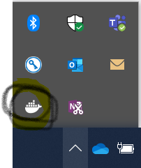
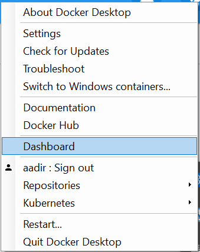
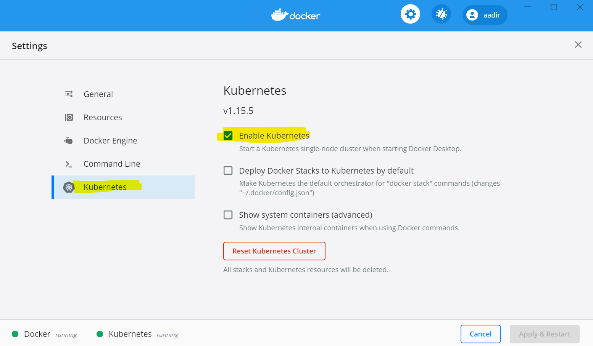
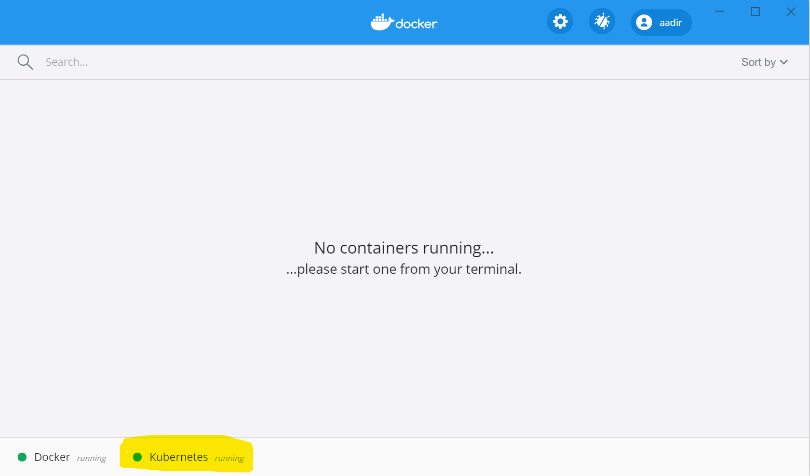
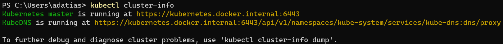
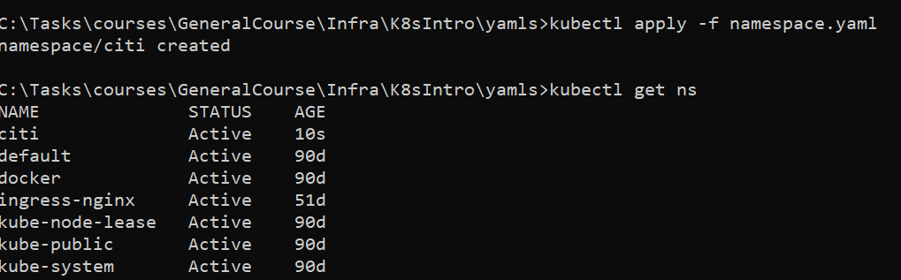
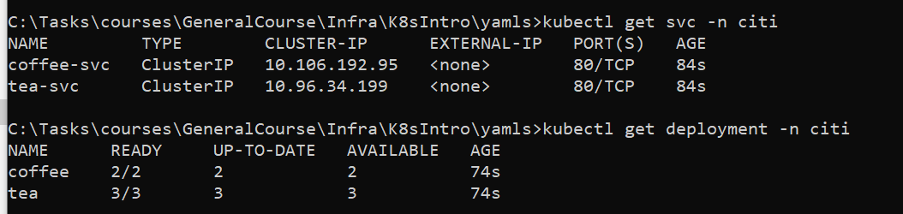
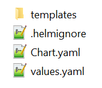
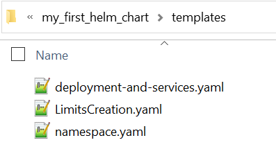
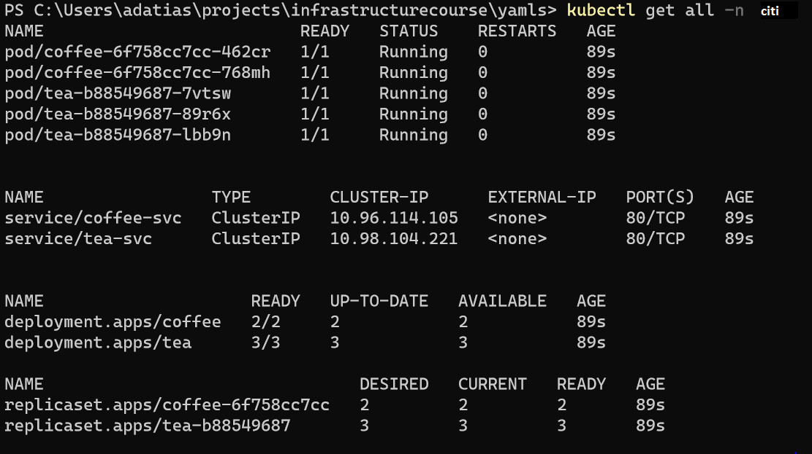

[[_TOC_]]

## Prerequisites
- [Docker for Desktop](https://hub.docker.com/editions/community/docker-ce-desktop-windows)
- [Kubectl](https://storage.googleapis.com/kubernetes-release/release/v1.18.6/bin/windows/amd64/kubectl.exe) (You might not need is, can be configured via Docker For Desktop. Just make sure you have kubectl on your machine)
- [Helm](https://github.com/helm/helm/releases/tag/v2.16.1) (Note that we still use Helm 2 for this lab, which is end of life soon)


#Overview
----
In his lab you are going to:
- Create local k8s cluster 
- Deploy 2 services
- setup access to your services by using ingress controller
- Automated the deployment with helm (Bonus milestone)

# Notes
----
- If you are connecting to any of k8s clusters, please make sure you are backup your kube.config 
usually located at 
- [x] WIN C:\Users\\<username>\.kube 
- [x] MAC/Linux ~/.kube/config

# Glossary
----
- k8s is kubernetes
 

# Task 1 - Enable kubernetes with docker-desktop
---
## 1. Install [docker-desktop](https://www.docker.com/products/docker-desktop) 
and follow the instructions.

## 2. Enable k8s within docker-desktop
- [x] open the dashboard (Right click on Docker icon & press on dashboard)



 - [x] Press on settings and then Mark the checkbox for enable Kubernetes

- [x] Make sure k8s is up and running from UI

- [x] Make sure k8s is up and running from CLI


# Task 2 - Create namespace with kubectl command 
---

## 1. Create mdatp namespace yaml
Create a yaml file "namespace.yaml"
```
apiVersion: v1 
kind: Namespace 
metadata: 
  name: citi
```

## 2. Create & validate namespace
```
kubectl apply -f namespace.yaml
kubectl get namespaces
```


# Task 3 - Create Limits 
## 1. Create Limits yaml
create a yaml file "LimitsCreation.yaml"
```
apiVersion: v1
kind: LimitRange
metadata:
  name: limit-range
  namespace: citi
spec:
  limits:
  - defaultRequest:
      cpu: 100m
      memory: 256Mi
    max:
      cpu: 1000m
      memory: 3Gi
    min:
      cpu: 5m
      memory: 5Mi
    type: Container
```

## 2. Create & Validate the limits
```
kubectl apply -f LimitsCreation.yaml
kubectl get limits -n citi
kubectl describe limits -n citi limit-range
```


# Task 4 - Create Services & Deployments
## 1. Create Deployment and services yaml
Create a yaml file "deployments-and-services.yaml"
```
apiVersion: apps/v1 
kind: Deployment 
metadata: 
  name: coffee 
  namespace: citi
spec: 
  replicas: 2 
  selector: 
    matchLabels: 
      app: coffee 
  template: 
    metadata: 
      labels: 
        app: coffee 
    spec: 
      containers: 
      - name: coffee 
        image: nginxdemos/hello:plain-text 
        ports: 
        - containerPort: 80

--- 

apiVersion: v1 
kind: Service 
metadata: 
  name: coffee-svc 
  namespace: citi
spec: 
  ports: 
  - port: 80 
    targetPort: 80 
    protocol: TCP 
    name: http 
  selector: 
    app: coffee 
    
--- 
apiVersion: apps/v1

kind: Deployment 
metadata: 
  name: tea 
  namespace: citi
spec: 
  replicas: 3 
  selector: 
    matchLabels: 
      app: tea  
  template: 
    metadata: 
      labels: 
        app: tea  
    spec: 
      containers: 
      - name: tea  
        image: nginxdemos/hello:plain-text 
        ports: 
        - containerPort: 80

--- 

apiVersion: v1
kind: Service
metadata:
  name: tea-svc
  namespace: citi
  labels: 
spec: 
  ports: 
  - port: 80 
    targetPort: 80 
    protocol: TCP 
    name: http 
  selector: 
    app: tea 

```
## 2. Create & validate services and deployments
```
kubectl apply -f deployments-and-services.yaml
kubectl get svc -n citi
kubectl get deployments -n citi
```


# Task 5 - Cleanup 
## 1. Clean all the resources
```
kubectl delete namespace citi
```
## 2. Validate the cleanup
```
kubectl get ns
kubectl get pods -n citi
```

# Task 6 - Use Helm to automate Tasks 2,3,4
## 1. Install Helm
- [x] Download the latest release[here](https://helm.sh/docs/intro/install/)
- [x] Extract to folder, and add the folder created to environment variables (path). 

## 2. Verify installation
```
helm version
```

## 3. Create your first helm chart
```
helm create my_first_helm_chart
```


## 4. Cleanup helm initial directory
- [x] Clean values.yaml file, should be empty
- [x] templates directory should be empty
- [x] Remove all files except the files below

## 5. Copy the files to helm templates directory

## 6. Install the helm chart
```
helm upgrade --install my-first-release my_first_release_chart
```

## 7. Validate the helm chart installation


## 8. Cleanup chart installation
```
helm del my-first-release
```


# Task 7 - Use Helm with values
## 1. Update your values.yaml with:
```
cafenamespace: test 
```
## 2. Find and replace mdatp to parameter
Go over all the files under templates and replace "mdatp" with "{{ .Values.cafenamespace }}"
## 3. Install the helm chart
```
helm upgrade --install my-first-release my_first_release_chart
```
## 4.Validate the helm chart installation


# Task 8 - Create Ingress Controller
## 1. Setup ingress controller as a cluster “entry point” 
```
kubectl apply -f https://raw.githubusercontent.com/kubernetes/ingress-nginx/nginx-0.22.0/deploy/mandatory.yaml 
```
## 2. Create nginx service yaml
Create a yaml file "ingress-nginx-service.yaml"
```
apiVersion: v1 
kind: Service 
metadata: 
  name: ingress-nginx 
  namespace: ingress-nginx 
  labels: 
    app.kubernetes.io/name: ingress-nginx 
    app.kubernetes.io/part-of: ingress-nginx 
spec: 
  type: NodePort 
  ports: 
    - name: http 
      port: 80 
      targetPort: 80 
      protocol: TCP 
    - name: https 
      port: 443 
      targetPort: 443 
      protocol: TCP 
  selector: 
    app.kubernetes.io/name: ingress-nginx 
    app.kubernetes.io/part-of: ingress-nginx 

```
## 3. create the nginx service and get the service port
```
kubectl apply -f ingress-nginx-service.yaml
kubectl get svc -n ingress-nginx 
```


## 4. Create Ingress rules yaml file

Create file "ingress.yaml"
```
apiVersion: apps/v1
kind: Ingress 
metadata: 
  name: coffee-ingress 
  namespace: citi 
  annotations: 
    kubernetes.io/ingress.class: nginx 
    nginx.ingress.kubernetes.io/rewrite-target: /$1 
spec: 
  rules: 
  - host: cafe.com 
    http: 
      paths:  
      - backend: 
          serviceName: coffee-svc 
          servicePort: 80 
        path: /coffee   
--- 
 
apiVersion: apps/v1
kind: Ingress 
metadata: 
  name: tea-ingress 
  namespace: citi 
  annotations: 
    kubernetes.io/ingress.class: nginx 
    nginx.ingress.kubernetes.io/rewrite-target: /$1 
spec: 
  rules: 
  - host: cafe.com 
    http: 
      paths:  
      - backend: 
          serviceName: tea-svc 
          servicePort: 80 
        path: /tea
```
## 5. Create ingress rules
```
kubectl apply -f ingress.yaml
```


## 6. Validate the ingress rules
### Update hosts file
add new record to hosts file (C:\Windows\System32\drivers\etc\hosts or /etc/hosts) 
```
127.0.0.1 cafe.com 
```

### troubleshoot for hosts file update
In case of cafe.com not redirect to 127.0.0.1
- [x] Edge browser - then try flushing your system's DNS cache (ipconfig /flushdns on Windows).
- [x] Chrome browser - has its own DNS cache. please visit chrome://net-internals/#sockets and click "Flush socket pools".

### Test the ingress rules
try to access from your browser GET HTTP option you want  (curl/postman/etc)
you should see the nginx response and the round robin change in the server-name/server-ip
- [x]  Browser
----
### Find the relevant port (in this case 32275)
```
kubectl get svc -n ingress-nginx
```

----
- http://cafe.com:<port>/coffee (in our case http://cafe.com:32275/coffee)
- http://cafe.com:<port>/tea (in our case http://cafe.com:32275/tea)

- [x] Postman extenstion
----
You can also user postman (chrome extension)
- http://cafe.com:32275/tea

- http://cafe.com:32275/coffee


